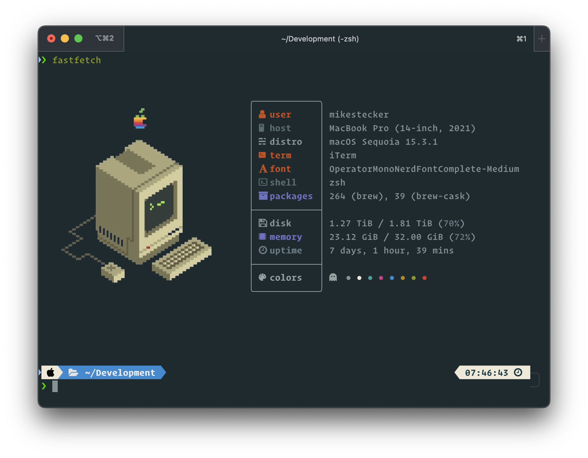

# mikestecker's dotfiles

[](https://github.com/mikestecker/dotfiles/actions)
[![Powered by dotbot][dbshield]][dblink]

[dblink]: https://github.com/anishathalye/dotbot
[dbshield]: https://img.shields.io/badge/powered%20by-dotbot-blue?style=flat

> Personal dotfiles configuration



| Component                     | Tool                                                      | Config                                   |
| ----------------------------- | --------------------------------------------------------- | ---------------------------------------- |
| Installation                  | [Dotbot](https://github.com/anishathalye/dotbot)          | [install.conf.yaml](./install.conf.yaml) |
| Theme                         | [Powerlevel10k](https://github.com/romkatv/powerlevel10k) | [p10k.zsh](./zsh/p10k.zsh)               |
| .zshrc                        | [oh-my-zsh](https://github.com/robbyrussell/oh-my-zsh)    | [.zshrc](./zsh/zshrc.zsh)                |
| Modern CLI Tools              | [bat](https://github.com/sharkdp/bat), [lazygit](https://github.com/jesseduffield/lazygit), [httpie](https://httpie.io/) | [aliases/](./aliases/)                   |

## [Makefile](./Makefile)

- Install with dotbot
- Homebrew save/restore
- VS Code extension save/restore

## Modern CLI Tools & Aliases

Enhanced command-line experience with modern alternatives to traditional tools:

### Core Tools

- **[bat](https://github.com/sharkdp/bat)** - Better `cat` with syntax highlighting (`cat` → `bat`)
- **[lazygit](https://github.com/jesseduffield/lazygit)** - Terminal UI for git (`lg`)
- **[httpie](https://httpie.io/)** - Better HTTP client (`hget`, `hpost`, etc.)
- **[tldr](https://tldr.sh/)** - Simplified man pages (`tl`, `mans`)
- **[delta](https://github.com/dandavison/delta)** - Better git diff (configured in git)

### Key Aliases

```bash
# File operations
cat file.js        # Uses bat with syntax highlighting
fzfp               # fzf with bat preview

# Git workflow  
lg                 # Open lazygit TUI
lgg ~/project      # Open lazygit in specific directory

# HTTP testing
hget api.github.com/users/mikestecker
hnext              # Quick test localhost:3000
hreact             # Quick test localhost:3000

# Documentation
tl git             # Quick tldr for git
mans docker        # Try tldr first, fallback to man
```

*See [aliases/modern-cli.aliases.sh](./aliases/modern-cli.aliases.sh) for complete list*

## Performance Optimizations

**High-performance shell configuration** with lazy loading and caching (default):

- **75%+ faster startup** (0.24s vs 0.97s)
- **Cached expensive operations** (brew prefix, path resolution)
- **Lazy loading** for NVM, rbenv, and heavy plugins
- **Background loading** of non-essential components

```bash
# Benchmark your shell performance
./scripts/benchmark-zsh

# Revert to original configuration if needed
cp zsh/zshrc-original.zsh zsh/zshrc.zsh
```

*See [docs/PERFORMANCE.md](./docs/PERFORMANCE.md) for detailed information*

## Usage

*Prerequisites: python, git, zsh*

### Installation

```sh
git clone git@github.com:mikestecker/dotfiles.git .dotfiles --recursive
cd .dotfiles
make install
```

### Other Tasks

*[See Makefile](./Makefile)*

### System Preferences

- Appearance
  - Dark Mode
- Show Scroll Bars -> "Always"
  - Ugly, but better for web development
- Dock
  - Remove most applications from Dock
  - Automatic Hide
  - Smaller Dock
  - "Show recent applications in Dock" -> off
  - "Show indicators for open applications" -> on
  - Battery -> "Show Percentage"
- Display
  - Nightshift
- Security
  - Touch ID
- Notifications
  - Off, except for Calendar
- Siri
  - Disabled
- Trackpad
  - Tap to Click
  - Point & Click -> Look up & data detectors off
  - More Gestures -> Notification Centre off
- Keyboard
  - Text
    - disable "Capitalize word automatically"
    - disable "Add full stop with double-space"
    - disable "Use smart quotes and dashes"
    - use " for double quotes
    - use ' for single quotes
- Mission Control
  - Hot Corners: disable all
- Finder
  - General
    - New Finder windows show: [Downloads]
    - Show these items on the desktop: disable all
  - Sidebar
    - activate all Favorites
    - move Library to Favorites
  - Show only:
    - Desktop
    - Downloads
    - Documents
    - [User]
    - Library
- Advanced
  - Show all Filename Extensions
  - Remove Items from Bin after 30 Days
  - View -> Show Preview (e.g. image files)
- Sharing
  - "Change computer name"
  - Also terminal:
    - `sudo scutil --set ComputerName "newname"`
    - `sudo scutil --set LocalHostName "newname"`
    - `sudo scutil --set HostName "newname"`
  - "Make sure all file sharing is disabled"
- Security and Privacy
  - Turn on FileVault
  - Add Browser to "Screen Recording"
- Storage
  - Remove Garage Band & Sound Library
  - Remove iMovie
- Trackpad
  - Speed: Max
- Accessibility
  - Scroll Speed: Max
